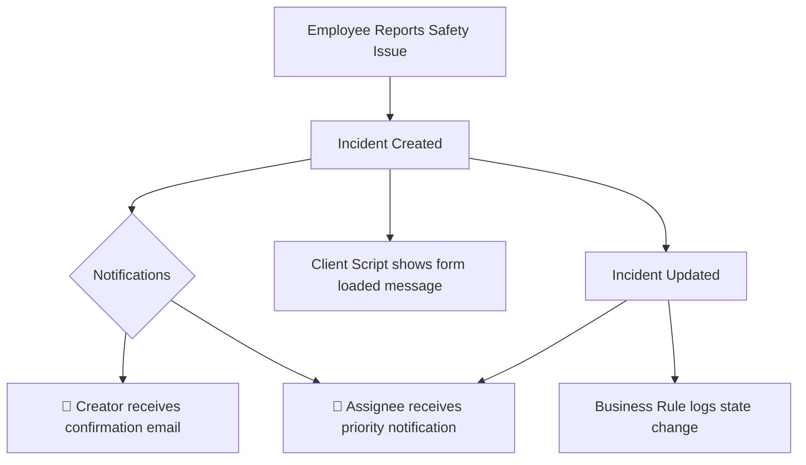

# Report a Safety Issue

> **See something, report something – be safe!**

A ServiceNow scoped application that streamlines the reporting and management of workplace safety incidents. Built using the [Now SDK Fluent DSL](https://docs.servicenow.com), it leverages the Incident table to track safety issues with automated notifications, state-change logging, and user-friendly form messaging.

---

## Table of Contents

- [Overview](#overview)
- [Features](#features)
- [Architecture](#architecture)
- [Project Structure](#project-structure)
- [Metadata Components](#metadata-components)
- [Getting Started](#getting-started)
- [Build & Deploy](#build--deploy)
- [Configuration](#configuration)
- [Author](#author)

---

## Overview

| Property | Value |
|----------|-------|
| **App Name** | Report a Safety Issue |
| **Scope** | `x_376275_safety` |
| **Version** | 1.0.0 |
| **Platform** | ServiceNow (Incident table) |
| **SDK Version** | @servicenow/sdk 4.8.0 |

This application provides a safety incident reporting workflow where employees can report hazards or safety concerns. It uses the ServiceNow Incident table and adds automation for notifications and state tracking.

---

## Features

### 🔔 Email Notifications
- **Creator Notification** — Automatically sends a confirmation email to the person who reported the safety incident, acknowledging receipt with incident details.
- **Assignee Notification** — Notifies the assigned resolver about the incident priority and details when they are assigned.

### 📋 Client Script
- **Form Load Message** — Displays an informational banner ("Table loaded successfully!!") when the incident form is loaded, confirming the form is ready for input.

### ⚙️ Business Rule
- **State Change Logger** — Fires after an incident update to log a message showing the previous and new state values, providing audit visibility into state transitions.

---

## Architecture



---

## Project Structure

```
├── README.md                    # This documentation
├── now.config.json              # App scope & SDK configuration
├── package.json                 # Dependencies & build scripts
└── src/
    ├── tsconfig.json            # Root TypeScript config
    ├── tsconfig.client.json     # Client-side TS config
    ├── tsconfig.server.json     # Server-side TS config
    ├── fluent/
    │   ├── example.now.ts       # Client Script & Business Rule definitions
    │   └── notifications.now.ts # Email Notification definitions
    └── server/
        ├── script.ts            # Server-side module (state change logic)
        └── tsconfig.json        # Server module TS config
```

---

## Metadata Components

### Client Script — `my_client_script`

| Property | Value |
|----------|-------|
| Table | `incident` |
| Type | `onLoad` |
| Description | Displays info message when incident form loads |

### Business Rule — `LogStateChange`

| Property | Value |
|----------|-------|
| Table | `incident` |
| When | After |
| Action | Update |
| Script Module | `src/server/script.ts` → `showStateUpdate()` |

The business rule uses a modular server-side script that compares `current.state` with `previous.state` and outputs an info message.

### Email Notification — `Safety Report Received - Creator`

| Property | Value |
|----------|-------|
| Table | `incident` |
| Trigger | On Insert |
| Recipient | Record Creator |
| Subject | `Safety Incident ${number} - Report Received` |

### Email Notification — `Safety Report Assignment - Assignee Priority`

| Property | Value |
|----------|-------|
| Table | `incident` |
| Trigger | On Insert & Update |
| Condition | `assigned_to IS NOT EMPTY` |
| Recipient | Assigned To (field) |
| Subject | `Safety Incident ${number} - Priority: ${priority}` |

---

## Getting Started

### Prerequisites

- ServiceNow PDI or developer instance
- Node.js (v18+)
- Now SDK CLI authenticated to your instance

### Installation

1. **Clone the repository:**
   ```bash
   git clone <repository-url>
   cd <project-directory>
   ```

2. **Install dependencies:**
   ```bash
   npm install
   ```

3. **Build the application:**
   ```bash
   npm run build
   ```

4. **Deploy to your instance:**
   ```bash
   npm run deploy
   ```

---

## Build & Deploy

| Command | Description |
|---------|-------------|
| `npm run build` | Compiles Fluent metadata into deployable XML |
| `npm run deploy` | Installs the built app to the connected instance |
| `npm run transform` | Transforms instance metadata to Fluent source |
| `npm run types` | Regenerates type definitions from dependencies |

---

## Configuration

The application is configured via `now.config.json`:

```json
{
  "scope": "x_376275_safety",
  "scopeId": "67941d802f8ec310c600e7ca6fa4e3c2",
  "name": "Report a Safety Issue",
  "tsconfigPath": "./src/server/tsconfig.json"
}
```

---

## Author

**Ismita**

---

## License

UNLICENSED
